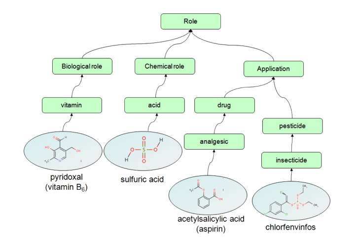
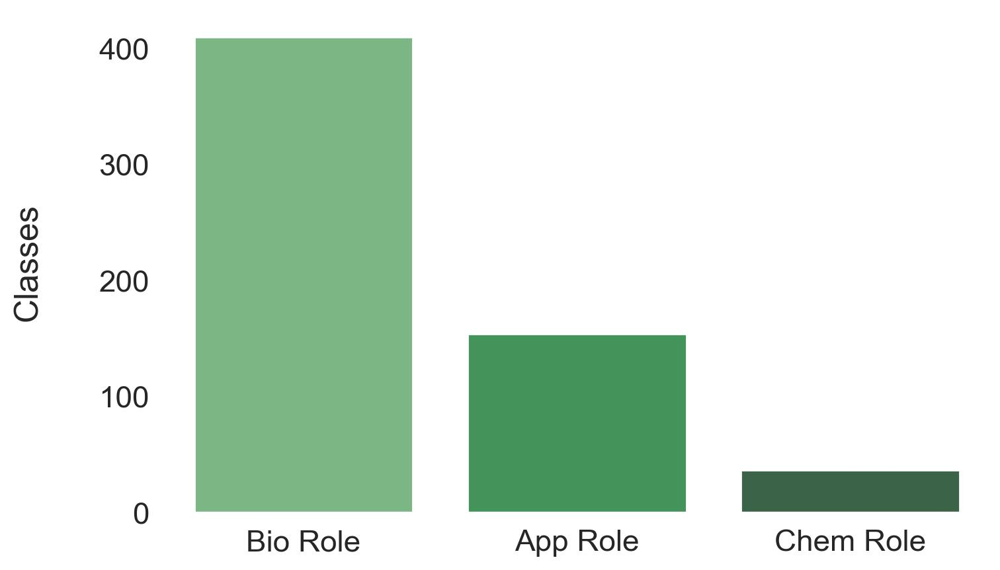
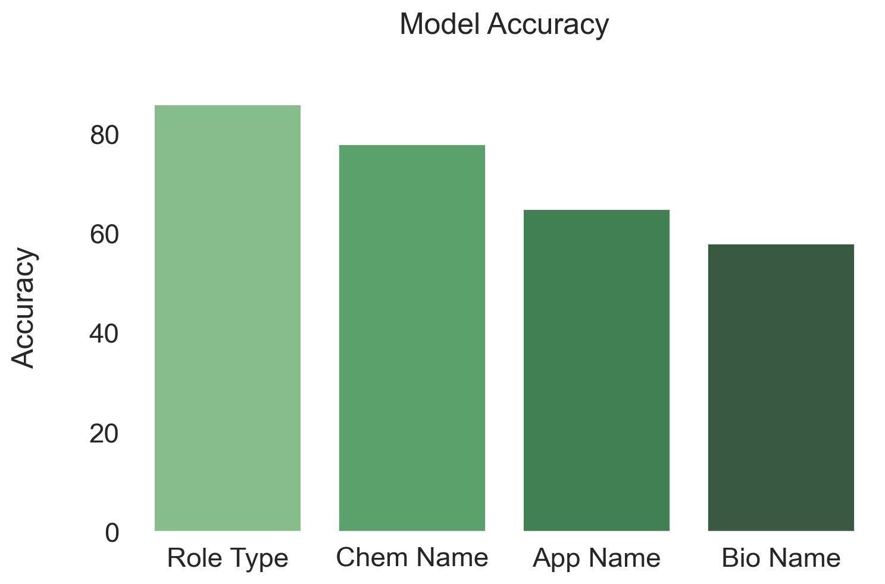

# Natural Product Classifier

**Author: Meir Alelov**


On average, it takes 10 years and $2.6 billion for a new medicine to complete the journey from initial discovery to the marketplace. This project uses chemical and physical properties of known compounds to classify the ontology of natural compounds based on their role type and role name. The Random Forest Classifier I have built performs with 86% accuracy for 'Role Type' classification, and an average of 66.3% for the 'Role Name' classifications. Having such a tool provides key insights into experimental procedures catered toward drug discovery, and can therefore significantly increase efficiency of drug discovery pipelines, proving to be financially benefitial to pharmaceutical companies.


## Business Understanding
The staggering cost and vast timeline necessary to bring a new drug to fruition are both factors which pose as some major obstacles for pharmaceutical companies in sending potential candidates through drug pipelines. This is, in part, due to the plethora of available methods and experimental parameters used throughout a drug discovery pipeline. My model aims to address this problem and therefore increase the efficiency of drug discovery pipelines. 

Accurate classification of the 'Role Type' of a natural product can point scientists in the right direction when ascertaining the mode of action for this potential pharmacotherapeutic.

My model's classification of 'Role Name' allows pharmaceutical companies to avoid unnecessary testing during target discovery.

Using feature importances from my models allows scientists to more accurately tune the parameters of target discovery expriments from the get go.

### Natural Products

Throughout history, natural products, as well as their structural analogues, have made major contributions to pharmacotherapy. Cancer and infections disease treatments heavily rely on the study and application of these naturally occuring compounds. According to "Natural products in drug discovery: advances and opportunities", a review which summarizes recent technological developments that are enabling natural product-based drug discovery, natural products are structurally ‘optimized’ by evolution to serve particular biological functions. 

https://www.nature.com/articles/s41573-020-00114-z#citeas

### Target Discovery

The very first preclinical step of a drug discovery pipeline is target discovery. During the first phase, in vitro research is performed to identify targets involved in the specific diseases in question. A target is usually a molecule integral to gene regulation or intracellular signaling, such as a nucleic acid sequence or protein. Good target identification increases confidence in the relationship between target and disease.

## Data Understanding
ChEBI is a chemical database and ontology of molecular entities focused on 'small' chemical compounds, that is part of the Open Biomedical Ontologies effort at the European Bioinformatics Institute. ChEBI is specific to entities of biological interest. The molecular entities in question are all natural products. ChEBI incorporates an ontological classification, whereby the relationships between molecular entities or classes of entities and their parents and/or children are specified.

PubChem is an open chemistry database at the National Institutes of Health (NIH). PubChem mostly contains small molecules, but also larger molecules such as nucleotides, carbohydrates, lipids, peptides, and chemically-modified macromolecules. We collect information on chemical structures, identifiers, chemical and physical properties, biological activities, patents, health, safety, toxicity data, and many others.

The following flowchart is taken from ChEBI Ontology Annotation Manual


### Data Justifications
I chose to use chemical compounds with only 1 role for training, as my goal is to give a clearer picture of the incoming unknown compounds, as opposed to a combination of potential roles. I want one clear direction to go in, as this will speed up drug discovery processes. 

After constructing the final data frame I was left with over 10,000 different compounds, each of which containing 18 features. 

The data or input for the model was chemical and physical properties of the compounds. These features are important as they tell us what is very close to the entire story about a compound. 

### Target Hierarchy



The targets, or outputs, were of a hierarchical nature. 

The broader category, role type, had only 3 classes while the role name subcategory had 600 specific role names associated with all the role types. For example, if the model classified a compound as having a biological role type, there are over 400 potential role name labels associated with it. 

It is for this reason that I have 4 distinct models. 

1 model for the role type, and 3 models for the role name of each possible role type class. 

## Modeling and Evaluation
### Accuracy Metric
Within the scope of drug discovery and pipelines, since I'm trying to increase efficiency at the preliminary target discovery stage, I am only concerned with accuracy. 

If the model predicts biological role for a drug compound that, in fact, is a pharmaceutical application, a pharmaceutical company will not suffer significant capital loss in the process. Rather, they will simply be in their exploratory stage as if they didn't have the model in the first place. 

Wrong classification will not result in lost funds as this exploratory process is of the trial-and-error nature. Without this model, they would be in the same position had the model pointed them in the wrong direction and falsely classified a compound. 

Since there are years and scores of experiments to be done on the product once the very first preliminary step of drug discovery is reached, safety and pharmacokinetics will be examined down the line.



### Final Role Type Model

Random Forest Classifier performed best, and the final model for predicting role type accounts for 86% of the variance in the role type target.

The final model performs with around 86% accuracy on unseen data, compared to the cross validation holdout sets' performance of 85%, and the baseline model performance of 47%. This is a significant increase from the baseline. The model performed with 97% accuracy on training data, which suggest the model could have been overfit. 

An 85% accuracy score for classifying unknown compounds will, in fact, create a more streamlined and efficient drug pipeline. Scientists will be able to find their drug target discovery quicker, and also avoid unnecessary testing, wasting resources, in the process.

 ### Final Role Name Bio Model

 Again, Random Forest Classifier outperformed the rest. My final model for classifying name of biological roles accounts for 56% of the variance for the role name of a biological role type. It performed with 56% accuracy on unseen data, 57% accuracy in the holdout set during the cross validatoin, and 95% accuracy on training data. This suggests the model is overfit.

The baseline model performed with 19% accuracy, so, although overfit, this final model performed significantly better.

### Final Role Name Chem Model

This model surprised me in that it performed with 78% accuracy on unseen data, meanwhile the holdout sets of the cross validation performed with 50% accuracy. Since the cross val score is a mean of all the splits, and since there was no data leakage, I believe the model saw a 'lucky' sample during the unseen test data and performed exceptionally well.

This final model, however, performed significantly better than the baseline which was testing at 32%.

### Final Role Name App Model

The final model for predicting the specific name of the pharmaceutical application role type of a compound performed with 65% accuracy on unseen data, 65% accuracy mean for all the splits of the cross validation, and 100% on the training data. This is a red flag, as the model is incredibly overfit. 

It's worth nothing that since the baseline model performed at 34%, this is a significant improvement. 


## Conclusions

The Random Forest Classifier I have built performs with 86% accuracy for 'Role Type' classification, and an average of 66.3% for the 'Role Name' classifications.

- Pharmaceutical companies can use the role **type** classification to determine the best drug pipeline to send a newly discovered molecule through.


- Some drug discovery methods are better suited for certain roles than others. Role **name** classification can shed light on which specific tests to use.


- When performing these tests you can use **feature importances** to better tune the experiment parameters right off the bat.


Having such a tool provides key insights into experimental procedures catered toward drug discovery, and can therefore significantly increase efficiency of drug discovery pipelines, proving to be financially benefitial to pharmaceutical companies.

## For faster accessibility:


You may find the final notebook 
[here](final_notebook.ipynb)

and you may find the presentation
[here](presentation.pdf)

### Instructions to recreate environment:

This project was build in a virtual environment using anaconda. You can find the necessary packages to recreate this environment in the environment.yml file inside the 'env' folder in the repository. You will find that streamlit also works in this environment, as it was necessary for the app. 

Once you have downloaded the environment.yml file, simply input the following in your terminal: 

``` conda env create -f environment.yml```

Data access instructions:

You can find these instructions in the notebook titled 'data_compilation'. You do not need to run the code to access the data necessary for the 'final_notebook'. Files and models are saved both in the data folder, as well as the notebook folder, for workflow accessibility. 

## Repository Navigation


```
├── README.md					              <- The top-level README for reviewers of this project
├── final_notebook.ipynb	            <- Narrative documentation of analysis in Jupyter notebook
├── data_compiling.ipynb	            <- Narrative documentation of data compilation in Jupyter notebook
├── notebooks					               <- versions of working notebooks
│   ├── all_in_one_notebook.ipynb	  	<- jupyter notebook containing all the code
│   ├── visualizations.ipynb	        <- jupyter notebook with image generation from code
│   └── saved models and data files		
├── Presentation.pdf			          <- PDF version of project presentation
├── app	                      <- Contains app script and demo
├── env                 	     <- Contains environment.yml file and env recreation instructions
├── data                       <- Contains saved models and dataset files in the form of .tsv
└── images                     <- Both sourced externally and generated from code

```
